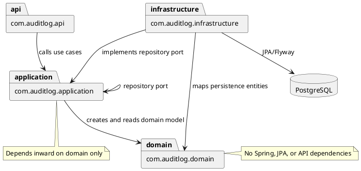
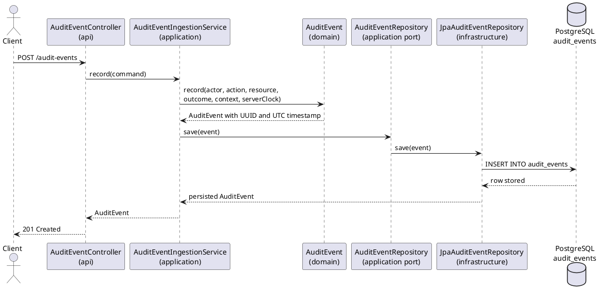

# Audit Log Service

## Description

Audit Log Service is an internal Spring Boot service for receiving audit events from other company services and storing them immutably in PostgreSQL. It is intended for compliance, security, and observability workflows used by compliance officers, SREs, and security analysts.

The service is built with Java 21, Spring Boot 3, Gradle Kotlin DSL, PostgreSQL, Flyway, and Testcontainers.

## Features

- Append-only audit event ingestion through `POST /audit-events`.
- Server-generated UTC timestamps for every event.
- Required actor, action, resource, and outcome fields.
- JSONB event context storage.
- Query endpoint with actor, resource, time range, limit, and offset filters.
- Flyway-managed database schema.
- PostgreSQL trigger that rejects updates to `audit_events`.
- Docker Compose setup for the app and PostgreSQL.
- Actuator health endpoint with database readiness checks.

## Quick Start

Start the full stack:

```bash
docker compose up --build
```

The app listens on `http://localhost:8080`. PostgreSQL is exposed on `localhost:5432` and is also reachable by the app through the Compose service host `db`.

Check service health:

```bash
curl http://localhost:8080/actuator/health
```

Stop the stack:

```bash
docker compose down
```

Remove the local PostgreSQL volume when you need a clean database:

```bash
docker compose down -v
```

## API / Usage

Create an audit event:

```bash
curl -i -X POST http://localhost:8080/audit-events \
  -H 'Content-Type: application/json' \
  -d '{
    "actor": "service:billing",
    "action": "invoice.created",
    "resource": "invoice/123",
    "outcome": "SUCCESS",
    "context": {
      "traceId": "abc"
    }
  }'
```

Successful writes return `201 Created` with a `Location` header.

Query audit events:

```bash
curl 'http://localhost:8080/audit-events?actor=service:billing&resource=invoice/123&limit=50&offset=0'
```

Supported query parameters:

- `actor`
- `resource`
- `from` as an ISO-8601 timestamp
- `to` as an ISO-8601 timestamp
- `limit`, default `100`, maximum `500`
- `offset`, default `0`

Valid outcomes:

- `SUCCESS`
- `DENIED`
- `ERROR`

## Architecture

The code follows a DDD-oriented clean architecture structure:

- `domain`: framework-free business model and invariants.
- `application`: use cases, commands, query criteria, and repository ports.
- `infrastructure`: Spring configuration, JPA persistence adapter, Flyway migrations, and database startup verification.
- `api`: REST controllers and HTTP request/response models.

Database schema changes live in `src/main/resources/db/migration`. Hibernate validates the schema at startup, but Flyway owns schema creation and migration.

Package dependencies:



Audit event storage flow:



## Configuration

Runtime configuration is provided through environment variables:

| Variable | Default | Description |
| --- | --- | --- |
| `SERVER_PORT` | `8080` | HTTP port for the service. |
| `SPRING_DATASOURCE_URL` | `jdbc:postgresql://localhost:5432/audit_log` | JDBC URL for PostgreSQL. |
| `SPRING_DATASOURCE_USERNAME` | `audit` | PostgreSQL username. |
| `SPRING_DATASOURCE_PASSWORD` | `audit` | PostgreSQL password. |

Docker Compose sets the datasource URL to `jdbc:postgresql://db:5432/audit_log` so the app connects to the PostgreSQL service inside the Compose network.

## Testing

Run the test suite:

```bash
./gradlew test
```

If Gradle is not installed locally, build through Docker:

```bash
docker compose build app
```

Current tests cover:

- Domain event creation and actor validation.
- PostgreSQL connectivity with Testcontainers.
- Persistence of audit events.
- Rejection of direct updates to `audit_events`.

## Documentation

Key files:

- `AGENTS.md`: project-specific engineering rules and invariants.
- `compose.yaml`: local app and PostgreSQL stack.
- `Dockerfile`: multi-stage Java 21 container build.
- `.github/workflows/ci.yml`: GitHub Actions build and test workflow.
- `src/main/resources/application.yml`: Spring runtime defaults.
- `src/main/resources/db/migration`: Flyway database migrations.
